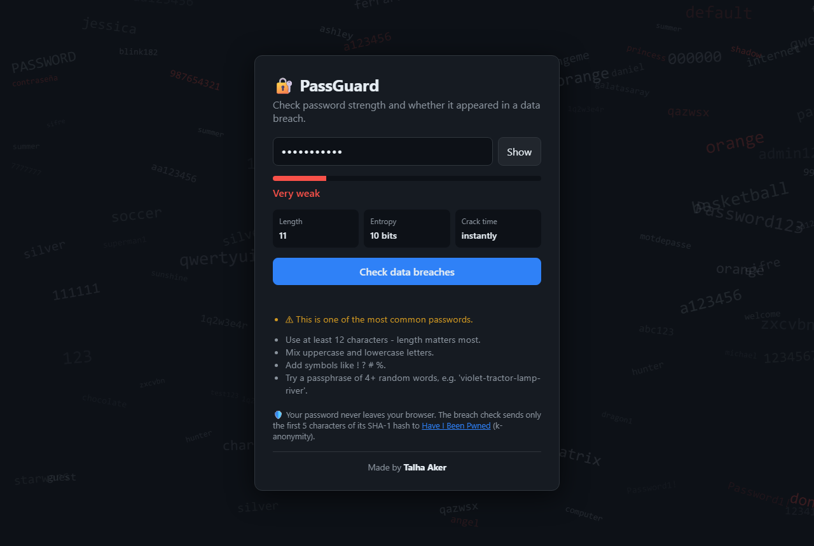

# 🔐 PassGuard


A password strength and data breach checker, available as a **Python CLI** and a **web app**.

It estimates how long a password would take to crack and checks whether it appeared in real
data breaches through the [Have I Been Pwned](https://haveibeenpwned.com/Passwords) API.
Your password is never sent anywhere.

**🌐 Live demo:** https://t4lh8.github.io/Passguard-Password-Strength-Checker/



## Features

- **Entropy-based strength scoring** from *Very weak* to *Very strong*
- **Estimated crack time** for an offline attack at 10 billion guesses per second
- **Weak pattern detection**: common passwords, leetspeak variants (`p@ssw0rd`), keyboard walks (`qwerty`, `1234`) and repeated or sequential characters
- **Breach check** against 900M+ leaked passwords using **k-anonymity**
- Hidden input in the CLI (`getpass`), so the password never shows up in your terminal or shell history
- No dependencies, only the Python standard library

## How the breach check stays private (k-anonymity)

```
password  ──SHA-1──►  5BAA6 1E4C9B93F3F0682250B6CF8331B7EE68FD8
                      └─┬─┘ └───────────────┬──────────────────┘
          sent to the API                   kept on your machine
```

1. The password is hashed locally with SHA-1.
2. Only the **first 5 characters** of the hash are sent to the API.
3. The API returns about 800 hash suffixes that share that prefix, and the match is done **locally**.
4. The `Add-Padding` header hides the real response size from anyone watching the network.

The server never learns the password or even its full hash.

## Usage

### CLI

```bash
git clone https://github.com/t4lh8/Passguard-Password-Strength-Checker.git
cd Passguard-Password-Strength-Checker
python -m passguard            # strength check + breach check
python -m passguard --offline  # strength check only
```

Example output:

```
Enter password to check (input hidden):

Strength:   [####----------------] Very weak
Length:     8 characters
Entropy:    ~10.0 bits (charset size 26)
Crack time: instantly (offline attack, 10B guesses/sec)
Breaches:   FOUND 52,372,427 times in data breaches - do not use it!

Warnings:
  ! This is one of the most common passwords.
```

### Web app

Open `docs/index.html` in a browser, or use the live demo. Everything runs in the browser
with the Web Crypto API.

### Tests

```bash
python -m unittest -v
```

## Project structure

```
passguard/
├── passguard/
│   ├── strength.py   # entropy, pattern detection, scoring
│   ├── breach.py     # Have I Been Pwned k-anonymity client
│   └── cli.py        # command line interface
├── docs/             # web app (served by GitHub Pages)
│   ├── index.html
│   ├── style.css
│   ├── app.js
│   └── background.js # animated background of common passwords
└── tests/            # unit tests (the network is mocked)
```

## What I learned

- How password **entropy** is calculated and why **length matters more than complexity**
- Why attackers use **dictionaries and pattern rules** instead of pure brute force
- **k-anonymity**, a way to query a sensitive database without revealing what you are looking for
- Hashing with **SHA-1** in both Python (`hashlib`) and JavaScript (Web Crypto API)
- Writing unit tests with **mocked network calls** and running them with **GitHub Actions**

## Disclaimer

Strength estimates are approximate. Real cracking tools such as Hashcat use large wordlists
and rules. For a production-grade estimator, see [zxcvbn](https://github.com/dropbox/zxcvbn).
Built for educational purposes.

## License

[MIT](LICENSE)
